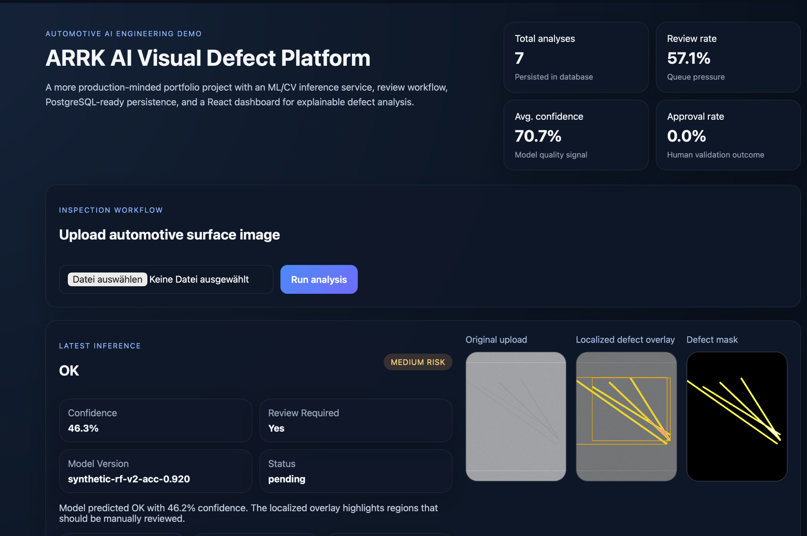
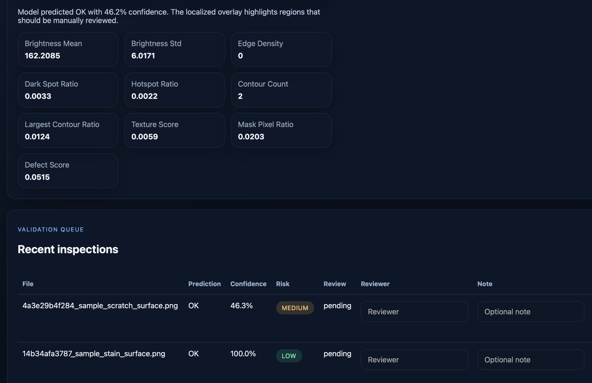

# AI Visual Defect Platform

A production-minded portfolio project for AI-assisted automotive defect inspection, designed to go beyond a simple proof-of-concept demo

- a **FastAPI backend** with structured API routes
- a more believable **ML/CV pipeline** using a trained Random Forest classifier on extracted image features
- a **React frontend** for upload, inspection review, and dashboard monitoring
- **PostgreSQL-ready persistence** with SQLAlchemy
- **Docker + docker-compose** for local full-stack startup
- **AWS/Azure deployment outlines** and CI workflow scaffolding

## Why this version is stronger

The first version was a very good concept demo. This version is closer to something you can confidently show in interviews because it demonstrates system thinking across the full stack:

- inference service
- review workflow
- persistent inspection history
- frontend dashboard UX
- cloud deployment readiness
- model training artifact lifecycle

## Architecture

```text
React frontend  ->  FastAPI backend  ->  PostgreSQL
                       |                  
                       +-> ML/CV model
                       +-> local storage for uploads / overlays
```

## Main workflow

1. Upload an image of an automotive component or surface.
2. Backend stores the upload and extracts CV features.
3. Trained model predicts one of: `OK`, `Scratch`, `Crack`, `Stain`, `Dent`.
4. Backend creates a localized defect overlay and binary defect mask for reviewability.
5. Result is persisted to the database.
6. Reviewer can approve / reject the finding from the React dashboard.
7. KPI cards update automatically.

## Screenshots

### Platform overview


### Inference and validation workflow

## Tech stack

### Backend
- FastAPI
- SQLAlchemy
- PostgreSQL / SQLite fallback
- OpenCV
- scikit-learn
- joblib

### Frontend
- React
- Vite
- Plain CSS for a clean portable UI

### DevOps / delivery
- Docker
- docker-compose
- GitHub Actions
- AWS / Azure deployment outlines

## Project structure

```text
arrk_ai_defect_demo_pro/
├── backend/
│   ├── app/
│   ├── data/
│   ├── requirements.txt
│   ├── tests/
│   └── .env.example
├── frontend/
│   ├── src/
│   ├── package.json
│   └── vite.config.js
├── deploy/
│   ├── aws/
│   └── azure/
├── assets/sample_images/
├── docker-compose.yml
├── Dockerfile.backend
├── Dockerfile.frontend
└── README.md
```

## Local run

### 1. Train the model artifact

```bash
python backend/scripts_train_model.py
```

### 2. Run backend

```bash
cd backend
python -m venv .venv
source .venv/bin/activate
pip install -r requirements.txt
cp .env.example .env
uvicorn app.main:app --reload
```

### 3. Run frontend

```bash
cd frontend
npm install
npm run dev
```

Frontend: `http://127.0.0.1:5173`
Backend API: `http://127.0.0.1:8000/api/v1`

## Full-stack with Docker

```bash
docker compose up --build
```

## API highlights

- `POST /api/v1/inspections` — upload and analyze an image
- `GET /api/v1/dashboard` — dashboard KPIs
- `GET /api/v1/inspections` — inspection history
- `PATCH /api/v1/inspections/{id}/review` — reviewer decision

## Interview framing

A strong way to present this project:

> I wanted to move beyond a toy AI demo, so I built a small but realistic inspection platform for automotive defect analysis. It includes an ML/CV inference service, explainability overlays, a React dashboard, human review workflow, and PostgreSQL-ready persistence. That helped me demonstrate not only model thinking, but also backend, product, and deployment awareness.

## Good next upgrades

- replace the current feature-based model with a CNN or ViT model
- move image storage to S3 or Azure Blob Storage
- add authentication and reviewer roles
- add model monitoring and drift tracking
- add Terraform for AWS / Azure provisioning
- add charts with time-series defect analytics
